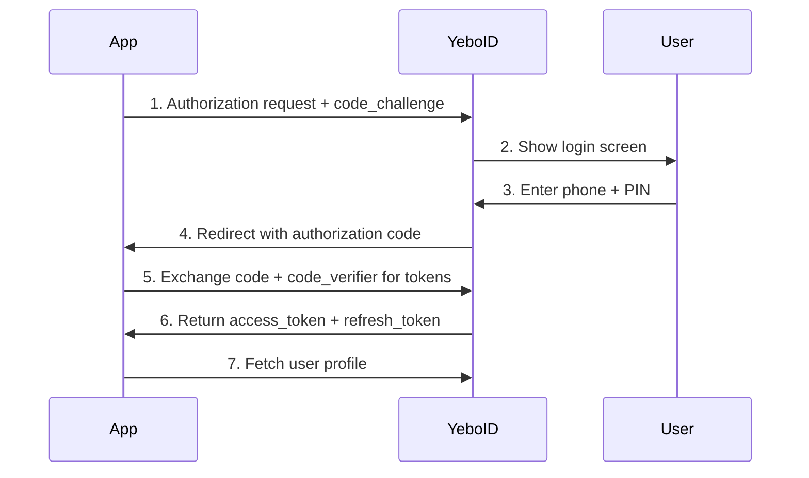

# Getting Started

Welcome to YeboID — the identity and authentication platform built for African applications.

## What is YeboID?

YeboID provides:

- **Phone-first authentication** — Users sign in with their phone number and PIN
- **KYC verification** — Verify user identity with government-issued IDs via YeboVerify
- **OAuth 2.0 + PKCE** — Industry-standard secure authentication
- **Pre-built UI components** — Beautiful Flutter widgets with Midnight Gold theme

## Prerequisites

Before integrating YeboID, you'll need:

1. **A YeboID Application** — Register at [yeboid.com](https://yeboid.com) to get your `client_id`
2. **Redirect URI** — Set up a custom URL scheme for your app (e.g., `yourapp://auth`)

## Integration Options

### Flutter SDK (Recommended)

The fastest way to add YeboID to your mobile app:

```dart
YeboIDProvider(
  config: YeboIDConfig(
    clientId: 'your-app-id',
    redirectUri: 'yourapp://auth',
  ),
  child: MyApp(),
)
```

[View Flutter SDK Documentation →](/flutter-sdk)

### Server-side SDKs

- **[Node.js SDK](/node-sdk/)** — Express middleware + token verification + the OAuth flow for Node/TypeScript backends.
- **[Web / React SDK](/web-sdk/)** — browser PKCE flow with React bindings.

### REST API

For backend integrations or custom implementations:

- OAuth 2.0 authorization endpoint: `https://yeboid.com/oauth/authorize`
- Token endpoint: `https://api.yeboid.com/oauth/token`
- User info endpoint: `https://api.yeboid.com/oauth/userinfo`

[View OAuth API Reference →](/api-reference/oauth)

## Authentication Flow

YeboID uses the standard OAuth 2.0 Authorization Code flow with PKCE:



### Token Lifecycle

| Token | Lifetime | Usage |
|-------|----------|-------|
| Access Token | 15 minutes | API requests (`Authorization: Bearer <token>`) |
| Refresh Token | 60 days | Get new access tokens |
| ID Token | 1 hour | Contains user claims (OpenID Connect) |

## KYC Verification

Users can optionally verify their identity through YeboVerify:

1. User taps "Verify Identity" in your app
2. Opens YeboVerify in browser
3. User uploads government ID + selfie
4. Verification processed (usually < 2 minutes)
5. User returns to your app with verified status

Verified users have:
- `kyc_status: "verified"`
- `kyc_country` — Country code from their ID
- `kyc_verified_at` — Timestamp of verification

## Supported Countries

YeboID currently supports phone numbers and KYC for:

| Country | Code | ID Types |
|---------|------|----------|
| Eswatini | SZ | National ID |
| South Africa | ZA | National ID, Passport |
| Mozambique | MZ | National ID |
| Kenya | KE | National ID |
| Nigeria | NG | National ID, Passport |

More countries coming soon.

## Next Steps

- [Flutter SDK Installation](/flutter-sdk)
- [Authentication Deep Dive](/authentication)
- [Widget Reference](/widgets/login-button)
- [API Reference](/api-reference)
